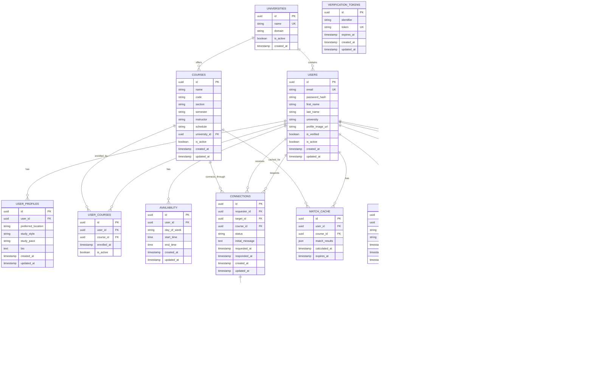

# Campus Connect Database Schema

## Table of Contents

1. [Overview](#overview)
2. [Entity Relationship Diagram](#entity-relationship-diagram)
3. [Database Design Principles](#database-design-principles)
4. [Table Definitions](#table-definitions)
5. [Indexes and Constraints](#indexes-and-constraints)
6. [Sample Data](#sample-data)
7. [Migration Strategy](#migration-strategy)
8. [Performance Considerations](#performance-considerations)

---

## Overview

The Campus Connect database is designed to support the core functionality of student matching, course enrollment, availability tracking, and real-time messaging. The schema is optimized for read-heavy operations with efficient querying for the matching algorithm.

**Database:** PostgreSQL 15+  
**ORM:** Prisma with Connection Pooling  
**Hosting:** Neon or Supabase (Serverless)  
**Caching:** Upstash Redis (Serverless)

---

## Entity Relationship Diagram



---

## Database Design Principles

### 1. Normalization
- **3rd Normal Form (3NF)** to eliminate redundancy
- Separate entities for users, courses, and connections
- Junction tables for many-to-many relationships

### 2. Performance Optimization
- **UUID primary keys** for distributed systems compatibility
- **Composite indexes** on frequently queried columns
- **Partial indexes** for conditional queries
- **JSON columns** for flexible data storage (match results)

### 3. Data Integrity
- **Foreign key constraints** to maintain referential integrity
- **Check constraints** for data validation
- **Unique constraints** where appropriate
- **Soft deletes** using `is_active` flags

### 4. Scalability
- **Horizontal partitioning** ready design
- **Efficient indexing** strategy for large datasets
- **Caching layer** integration points

---

## Table Definitions

### Users Table

```sql
CREATE TABLE users (
    id UUID PRIMARY KEY DEFAULT gen_random_uuid(),
    email VARCHAR(255) UNIQUE NOT NULL,
    password_hash VARCHAR(255) NOT NULL,
    first_name VARCHAR(100) NOT NULL,
    last_name VARCHAR(100) NOT NULL,
    university VARCHAR(255) NOT NULL,
    profile_image_url TEXT,
    is_verified BOOLEAN DEFAULT FALSE,
    is_active BOOLEAN DEFAULT TRUE,
    email_verified_at TIMESTAMP,
    last_login_at TIMESTAMP,
    created_at TIMESTAMP DEFAULT CURRENT_TIMESTAMP,
    updated_at TIMESTAMP DEFAULT CURRENT_TIMESTAMP
);

-- Indexes
CREATE INDEX idx_users_email ON users(email);
CREATE INDEX idx_users_university ON users(university);
CREATE INDEX idx_users_is_active ON users(is_active);
CREATE INDEX idx_users_created_at ON users(created_at);

-- Triggers
CREATE OR REPLACE FUNCTION update_updated_at_column()
RETURNS TRIGGER AS $$
BEGIN
    NEW.updated_at = CURRENT_TIMESTAMP;
    RETURN NEW;
END;
$$ language 'plpgsql';

CREATE TRIGGER update_users_updated_at 
    BEFORE UPDATE ON users 
    FOR EACH ROW EXECUTE FUNCTION update_updated_at_column();
```

### User Profiles Table

```sql
CREATE TABLE user_profiles (
    id UUID PRIMARY KEY DEFAULT gen_random_uuid(),
    user_id UUID NOT NULL REFERENCES users(id) ON DELETE CASCADE,
    preferred_location VARCHAR(50) CHECK (preferred_location IN ('library', 'cafe', 'home', 'study_room', 'any')),
    study_style VARCHAR(50) CHECK (study_style IN ('collaborative', 'quiet', 'mixed')),
    study_pace VARCHAR(50) CHECK (study_pace IN ('slow', 'moderate', 'fast')),
    bio TEXT,
    created_at TIMESTAMP DEFAULT CURRENT_TIMESTAMP,
    updated_at TIMESTAMP DEFAULT CURRENT_TIMESTAMP
);

-- Indexes
CREATE UNIQUE INDEX idx_user_profiles_user_id ON user_profiles(user_id);
CREATE INDEX idx_user_profiles_preferred_location ON user_profiles(preferred_location);
CREATE INDEX idx_user_profiles_study_style ON user_profiles(study_style);
CREATE INDEX idx_user_profiles_study_pace ON user_profiles(study_pace);

-- Triggers
CREATE TRIGGER update_user_profiles_updated_at 
    BEFORE UPDATE ON user_profiles 
    FOR EACH ROW EXECUTE FUNCTION update_updated_at_column();
```

### Universities Table

```sql
CREATE TABLE universities (
    id UUID PRIMARY KEY DEFAULT gen_random_uuid(),
    name VARCHAR(255) UNIQUE NOT NULL,
    domain VARCHAR(255) UNIQUE NOT NULL,
    is_active BOOLEAN DEFAULT TRUE,
    created_at TIMESTAMP DEFAULT CURRENT_TIMESTAMP
);

-- Indexes
CREATE UNIQUE INDEX idx_universities_name ON universities(name);
CREATE UNIQUE INDEX idx_universities_domain ON universities(domain);
CREATE INDEX idx_universities_is_active ON universities(is_active);
```

### Courses Table

```sql
CREATE TABLE courses (
    id UUID PRIMARY KEY DEFAULT gen_random_uuid(),
    name VARCHAR(255) NOT NULL,
    code VARCHAR(50) NOT NULL,
    section VARCHAR(10) NOT NULL,
    semester VARCHAR(20) NOT NULL,
    instructor VARCHAR(255),
    schedule TEXT,
    university_id UUID NOT NULL REFERENCES universities(id),
    is_active BOOLEAN DEFAULT TRUE,
    created_at TIMESTAMP DEFAULT CURRENT_TIMESTAMP,
    updated_at TIMESTAMP DEFAULT CURRENT_TIMESTAMP
);

-- Indexes
CREATE INDEX idx_courses_university_id ON courses(university_id);
CREATE INDEX idx_courses_code_section ON courses(code, section);
CREATE INDEX idx_courses_semester ON courses(semester);
CREATE INDEX idx_courses_is_active ON courses(is_active);
CREATE UNIQUE INDEX idx_courses_unique ON courses(code, section, semester, university_id);

-- Triggers
CREATE TRIGGER update_courses_updated_at 
    BEFORE UPDATE ON courses 
    FOR EACH ROW EXECUTE FUNCTION update_updated_at_column();
```

### User Courses Table

```sql
CREATE TABLE user_courses (
    id UUID PRIMARY KEY DEFAULT gen_random_uuid(),
    user_id UUID NOT NULL REFERENCES users(id) ON DELETE CASCADE,
    course_id UUID NOT NULL REFERENCES courses(id) ON DELETE CASCADE,
    enrolled_at TIMESTAMP DEFAULT CURRENT_TIMESTAMP,
    is_active BOOLEAN DEFAULT TRUE
);

-- Indexes
CREATE INDEX idx_user_courses_user_id ON user_courses(user_id);
CREATE INDEX idx_user_courses_course_id ON user_courses(course_id);
CREATE INDEX idx_user_courses_is_active ON user_courses(is_active);
CREATE UNIQUE INDEX idx_user_courses_unique ON user_courses(user_id, course_id);
```

### Availability Table (Partitioned for Performance)

```sql
-- Main partitioned table
CREATE TABLE availability (
    id UUID PRIMARY KEY DEFAULT gen_random_uuid(),
    user_id UUID NOT NULL REFERENCES users(id) ON DELETE CASCADE,
    day_of_week INTEGER CHECK (day_of_week BETWEEN 0 AND 6), -- 0=Sunday, 6=Saturday
    start_time TIME NOT NULL,
    end_time TIME NOT NULL,
    created_at TIMESTAMP DEFAULT CURRENT_TIMESTAMP,
    updated_at TIMESTAMP DEFAULT CURRENT_TIMESTAMP,
    CONSTRAINT valid_time_range CHECK (end_time > start_time)
) PARTITION BY RANGE (day_of_week);

-- Create partitions for each day of the week
CREATE TABLE availability_sunday PARTITION OF availability
    FOR VALUES FROM (0) TO (1);

CREATE TABLE availability_monday PARTITION OF availability
    FOR VALUES FROM (1) TO (2);

CREATE TABLE availability_tuesday PARTITION OF availability
    FOR VALUES FROM (2) TO (3);

CREATE TABLE availability_wednesday PARTITION OF availability
    FOR VALUES FROM (3) TO (4);

CREATE TABLE availability_thursday PARTITION OF availability
    FOR VALUES FROM (4) TO (5);

CREATE TABLE availability_friday PARTITION OF availability
    FOR VALUES FROM (5) TO (6);

CREATE TABLE availability_saturday PARTITION OF availability
    FOR VALUES FROM (6) TO (7);

-- Optimized indexes for each partition
CREATE INDEX idx_availability_monday_user_time ON availability_monday(user_id, start_time, end_time);
CREATE INDEX idx_availability_tuesday_user_time ON availability_tuesday(user_id, start_time, end_time);
CREATE INDEX idx_availability_wednesday_user_time ON availability_wednesday(user_id, start_time, end_time);
CREATE INDEX idx_availability_thursday_user_time ON availability_thursday(user_id, start_time, end_time);
CREATE INDEX idx_availability_friday_user_time ON availability_friday(user_id, start_time, end_time);
CREATE INDEX idx_availability_saturday_user_time ON availability_saturday(user_id, start_time, end_time);
CREATE INDEX idx_availability_sunday_user_time ON availability_sunday(user_id, start_time, end_time);

-- Global indexes for cross-partition queries
CREATE INDEX idx_availability_user_day_global ON availability(user_id, day_of_week);
CREATE INDEX idx_availability_matching_global ON availability(user_id, day_of_week, start_time, end_time);

-- Triggers
CREATE TRIGGER update_availability_updated_at 
    BEFORE UPDATE ON availability 
    FOR EACH ROW EXECUTE FUNCTION update_updated_at_column();
```

### Connections Table

```sql
CREATE TABLE connections (
    id UUID PRIMARY KEY DEFAULT gen_random_uuid(),
    requester_id UUID NOT NULL REFERENCES users(id) ON DELETE CASCADE,
    target_id UUID NOT NULL REFERENCES users(id) ON DELETE CASCADE,
    course_id UUID NOT NULL REFERENCES courses(id) ON DELETE CASCADE,
    status VARCHAR(20) DEFAULT 'pending' CHECK (status IN ('pending', 'accepted', 'declined', 'cancelled')),
    initial_message TEXT,
    requested_at TIMESTAMP DEFAULT CURRENT_TIMESTAMP,
    responded_at TIMESTAMP,
    created_at TIMESTAMP DEFAULT CURRENT_TIMESTAMP,
    updated_at TIMESTAMP DEFAULT CURRENT_TIMESTAMP,
    CONSTRAINT no_self_connection CHECK (requester_id != target_id)
);

-- Indexes
CREATE INDEX idx_connections_requester_id ON connections(requester_id);
CREATE INDEX idx_connections_target_id ON connections(target_id);
CREATE INDEX idx_connections_course_id ON connections(course_id);
CREATE INDEX idx_connections_status ON connections(status);
CREATE INDEX idx_connections_requested_at ON connections(requested_at);
CREATE UNIQUE INDEX idx_connections_unique ON connections(requester_id, target_id, course_id);

-- Triggers
CREATE TRIGGER update_connections_updated_at 
    BEFORE UPDATE ON connections 
    FOR EACH ROW EXECUTE FUNCTION update_updated_at_column();
```

### Messages Table

```sql
CREATE TABLE messages (
    id UUID PRIMARY KEY DEFAULT gen_random_uuid(),
    connection_id UUID NOT NULL REFERENCES connections(id) ON DELETE CASCADE,
    sender_id UUID NOT NULL REFERENCES users(id) ON DELETE CASCADE,
    content TEXT NOT NULL,
    message_type VARCHAR(20) DEFAULT 'text' CHECK (message_type IN ('text', 'image', 'file', 'system')),
    is_read BOOLEAN DEFAULT FALSE,
    created_at TIMESTAMP DEFAULT CURRENT_TIMESTAMP,
    updated_at TIMESTAMP DEFAULT CURRENT_TIMESTAMP
);

-- Indexes
CREATE INDEX idx_messages_connection_id ON messages(connection_id);
CREATE INDEX idx_messages_sender_id ON messages(sender_id);
CREATE INDEX idx_messages_created_at ON messages(created_at);
CREATE INDEX idx_messages_is_read ON messages(is_read);
CREATE INDEX idx_messages_connection_created ON messages(connection_id, created_at);

-- Triggers
CREATE TRIGGER update_messages_updated_at 
    BEFORE UPDATE ON messages 
    FOR EACH ROW EXECUTE FUNCTION update_updated_at_column();
```

### Match Cache Table

```sql
CREATE TABLE match_cache (
    id UUID PRIMARY KEY DEFAULT gen_random_uuid(),
    user_id UUID NOT NULL REFERENCES users(id) ON DELETE CASCADE,
    course_id UUID NOT NULL REFERENCES courses(id) ON DELETE CASCADE,
    match_results JSONB NOT NULL,
    calculated_at TIMESTAMP DEFAULT CURRENT_TIMESTAMP,
    expires_at TIMESTAMP NOT NULL
);

-- Indexes
CREATE INDEX idx_match_cache_user_course ON match_cache(user_id, course_id);
CREATE INDEX idx_match_cache_expires_at ON match_cache(expires_at);
CREATE INDEX idx_match_cache_calculated_at ON match_cache(calculated_at);
CREATE UNIQUE INDEX idx_match_cache_unique ON match_cache(user_id, course_id);
```

### User Sessions Table

```sql
CREATE TABLE user_sessions (
    id UUID PRIMARY KEY DEFAULT gen_random_uuid(),
    user_id UUID NOT NULL REFERENCES users(id) ON DELETE CASCADE,
    refresh_token VARCHAR(255) UNIQUE NOT NULL,
    device_info TEXT,
    ip_address INET,
    expires_at TIMESTAMP NOT NULL,
    created_at TIMESTAMP DEFAULT CURRENT_TIMESTAMP,
    updated_at TIMESTAMP DEFAULT CURRENT_TIMESTAMP
);

-- Indexes
CREATE INDEX idx_user_sessions_user_id ON user_sessions(user_id);
CREATE UNIQUE INDEX idx_user_sessions_refresh_token ON user_sessions(refresh_token);
CREATE INDEX idx_user_sessions_expires_at ON user_sessions(expires_at);

-- Triggers
CREATE TRIGGER update_user_sessions_updated_at 
    BEFORE UPDATE ON user_sessions 
    FOR EACH ROW EXECUTE FUNCTION update_updated_at_column();
```

---

## Indexes and Constraints

### Composite Indexes for Performance

```sql
-- For matching algorithm queries
CREATE INDEX idx_user_courses_active ON user_courses(user_id, course_id, is_active);
CREATE INDEX idx_availability_matching ON availability(user_id, day_of_week, start_time, end_time);

-- For connection queries
CREATE INDEX idx_connections_lookup ON connections(requester_id, target_id, status);
CREATE INDEX idx_connections_course_status ON connections(course_id, status, requested_at);

-- For message queries
CREATE INDEX idx_messages_connection_time ON messages(connection_id, created_at DESC);
CREATE INDEX idx_messages_unread ON messages(sender_id, is_read, created_at);

-- For user search
CREATE INDEX idx_users_search ON users(first_name, last_name, university) WHERE is_active = TRUE;
```

### Partial Indexes for Conditional Queries

```sql
-- Only active users
CREATE INDEX idx_users_active ON users(email, university) WHERE is_active = TRUE;

-- Only pending connections
CREATE INDEX idx_connections_pending ON connections(target_id, requested_at) WHERE status = 'pending';

-- Only unread messages
CREATE INDEX idx_messages_unread_count ON messages(connection_id) WHERE is_read = FALSE;

-- Only current semester courses
CREATE INDEX idx_courses_current ON courses(code, section) WHERE semester = 'Spring 2024' AND is_active = TRUE;
```

---

## Sample Data

### Universities

```sql
INSERT INTO universities (name, domain) VALUES
('University of California, Berkeley', 'berkeley.edu'),
('Stanford University', 'stanford.edu'),
('Massachusetts Institute of Technology', 'mit.edu'),
('Harvard University', 'harvard.edu'),
('University of California, Los Angeles', 'ucla.edu');
```

### Courses

```sql
INSERT INTO courses (name, code, section, semester, instructor, university_id) VALUES
('Data Structures and Algorithms', 'CS 161', '001', 'Spring 2024', 'Dr. Smith', 
 (SELECT id FROM universities WHERE domain = 'berkeley.edu')),
('Machine Learning', 'CS 189', '001', 'Spring 2024', 'Dr. Johnson',
 (SELECT id FROM universities WHERE domain = 'berkeley.edu')),
('Database Systems', 'CS 186', '001', 'Spring 2024', 'Dr. Williams',
 (SELECT id FROM universities WHERE domain = 'berkeley.edu'));
```

### Users

```sql
INSERT INTO users (email, password_hash, first_name, last_name, university) VALUES
('john.doe@berkeley.edu', '$2b$12$...', 'John', 'Doe', 'University of California, Berkeley'),
('jane.smith@berkeley.edu', '$2b$12$...', 'Jane', 'Smith', 'University of California, Berkeley'),
('bob.wilson@stanford.edu', '$2b$12$...', 'Bob', 'Wilson', 'Stanford University');
```

### User Profiles

```sql
INSERT INTO user_profiles (user_id, preferred_location, study_style, study_pace, bio) VALUES
((SELECT id FROM users WHERE email = 'john.doe@berkeley.edu'), 'library', 'collaborative', 'moderate', 
 'Computer Science student passionate about algorithms and data structures.'),
((SELECT id FROM users WHERE email = 'jane.smith@berkeley.edu'), 'cafe', 'quiet', 'fast',
 'Graduate student in Machine Learning. Love discussing AI concepts and implementations.'),
((SELECT id FROM users WHERE email = 'bob.wilson@stanford.edu'), 'study_room', 'mixed', 'slow',
 'Undergraduate studying Computer Science. Looking for study partners for challenging courses.');
```

### Availability

```sql
INSERT INTO availability (user_id, day_of_week, start_time, end_time) VALUES
((SELECT id FROM users WHERE email = 'john.doe@berkeley.edu'), 1, '09:00', '12:00'), -- Monday
((SELECT id FROM users WHERE email = 'john.doe@berkeley.edu'), 1, '14:00', '17:00'), -- Monday
((SELECT id FROM users WHERE email = 'john.doe@berkeley.edu'), 3, '10:00', '13:00'), -- Wednesday
((SELECT id FROM users WHERE email = 'jane.smith@berkeley.edu'), 1, '10:00', '12:00'), -- Monday
((SELECT id FROM users WHERE email = 'jane.smith@berkeley.edu'), 3, '09:00', '11:00'), -- Wednesday
((SELECT id FROM users WHERE email = 'bob.wilson@stanford.edu'), 2, '13:00', '16:00'), -- Tuesday
((SELECT id FROM users WHERE email = 'bob.wilson@stanford.edu'), 4, '14:00', '17:00'); -- Thursday
```

---

## Migration Strategy

### Prisma Schema

```prisma
// prisma/schema.prisma
generator client {
  provider = "prisma-client-js"
}

datasource db {
  provider = "postgresql"
  url      = env("DATABASE_URL")
}

model User {
  id                String    @id @default(dbgenerated("gen_random_uuid()")) @db.Uuid
  email             String    @unique
  passwordHash      String    @map("password_hash")
  firstName         String    @map("first_name")
  lastName          String    @map("last_name")
  university        String
  profileImageUrl   String?   @map("profile_image_url")
  isVerified        Boolean   @default(false) @map("is_verified")
  isActive          Boolean   @default(true) @map("is_active")
  emailVerifiedAt   DateTime? @map("email_verified_at")
  lastLoginAt       DateTime? @map("last_login_at")
  createdAt         DateTime  @default(now()) @map("created_at")
  updatedAt         DateTime  @updatedAt @map("updated_at")

  // Relations
  profile           UserProfile?
  userCourses       UserCourse[]
  availability      Availability[]
  sentConnections   Connection[] @relation("ConnectionRequester")
  receivedConnections Connection[] @relation("ConnectionTarget")
  sentMessages      Message[]
  matchCache        MatchCache[]
  sessions          UserSession[]

  @@map("users")
}

model UserProfile {
  id                String    @id @default(dbgenerated("gen_random_uuid()")) @db.Uuid
  userId            String    @unique @map("user_id") @db.Uuid
  preferredLocation String?   @map("preferred_location")
  studyStyle        String?   @map("study_style")
  studyPace         String?   @map("study_pace")
  bio               String?
  createdAt         DateTime  @default(now()) @map("created_at")
  updatedAt         DateTime  @updatedAt @map("updated_at")

  // Relations
  user              User      @relation(fields: [userId], references: [id], onDelete: Cascade)

  @@map("user_profiles")
}

model University {
  id        String    @id @default(dbgenerated("gen_random_uuid()")) @db.Uuid
  name      String    @unique
  domain    String    @unique
  isActive  Boolean   @default(true) @map("is_active")
  createdAt DateTime  @default(now()) @map("created_at")

  // Relations
  courses   Course[]

  @@map("universities")
}

model Course {
  id          String    @id @default(dbgenerated("gen_random_uuid()")) @db.Uuid
  name        String
  code        String
  section     String
  semester    String
  instructor  String?
  schedule    String?
  universityId String   @map("university_id") @db.Uuid
  isActive    Boolean   @default(true) @map("is_active")
  createdAt   DateTime  @default(now()) @map("created_at")
  updatedAt   DateTime  @updatedAt @map("updated_at")

  // Relations
  university  University @relation(fields: [universityId], references: [id])
  userCourses UserCourse[]
  connections Connection[]
  matchCache  MatchCache[]

  @@unique([code, section, semester, universityId])
  @@map("courses")
}

model UserCourse {
  id         String   @id @default(dbgenerated("gen_random_uuid()")) @db.Uuid
  userId     String   @map("user_id") @db.Uuid
  courseId   String   @map("course_id") @db.Uuid
  enrolledAt DateTime @default(now()) @map("enrolled_at")
  isActive   Boolean  @default(true) @map("is_active")

  // Relations
  user       User     @relation(fields: [userId], references: [id], onDelete: Cascade)
  course     Course   @relation(fields: [courseId], references: [id], onDelete: Cascade)

  @@unique([userId, courseId])
  @@map("user_courses")
}

model Availability {
  id          String   @id @default(dbgenerated("gen_random_uuid()")) @db.Uuid
  userId      String   @map("user_id") @db.Uuid
  dayOfWeek   Int      @map("day_of_week")
  startTime   String   @map("start_time") @db.Time
  endTime     String   @map("end_time") @db.Time
  createdAt   DateTime @default(now()) @map("created_at")
  updatedAt   DateTime @updatedAt @map("updated_at")

  // Relations
  user        User     @relation(fields: [userId], references: [id], onDelete: Cascade)

  @@map("availability")
}

model Connection {
  id             String    @id @default(dbgenerated("gen_random_uuid()")) @db.Uuid
  requesterId    String    @map("requester_id") @db.Uuid
  targetId       String    @map("target_id") @db.Uuid
  courseId       String    @map("course_id") @db.Uuid
  status         String    @default("pending")
  initialMessage String?   @map("initial_message")
  requestedAt    DateTime  @default(now()) @map("requested_at")
  respondedAt    DateTime? @map("responded_at")
  createdAt      DateTime  @default(now()) @map("created_at")
  updatedAt      DateTime  @updatedAt @map("updated_at")

  // Relations
  requester      User      @relation("ConnectionRequester", fields: [requesterId], references: [id], onDelete: Cascade)
  target         User      @relation("ConnectionTarget", fields: [targetId], references: [id], onDelete: Cascade)
  course         Course    @relation(fields: [courseId], references: [id], onDelete: Cascade)
  messages       Message[]

  @@unique([requesterId, targetId, courseId])
  @@map("connections")
}

model Message {
  id           String   @id @default(dbgenerated("gen_random_uuid()")) @db.Uuid
  connectionId String   @map("connection_id") @db.Uuid
  senderId     String   @map("sender_id") @db.Uuid
  content      String
  messageType  String   @default("text") @map("message_type")
  isRead       Boolean  @default(false) @map("is_read")
  createdAt    DateTime @default(now()) @map("created_at")
  updatedAt    DateTime @updatedAt @map("updated_at")

  // Relations
  connection   Connection @relation(fields: [connectionId], references: [id], onDelete: Cascade)
  sender       User       @relation(fields: [senderId], references: [id], onDelete: Cascade)

  @@map("messages")
}

model MatchCache {
  id            String   @id @default(dbgenerated("gen_random_uuid()")) @db.Uuid
  userId        String   @map("user_id") @db.Uuid
  courseId      String   @map("course_id") @db.Uuid
  matchResults  Json     @map("match_results")
  calculatedAt  DateTime @default(now()) @map("calculated_at")
  expiresAt     DateTime @map("expires_at")

  // Relations
  user          User     @relation(fields: [userId], references: [id], onDelete: Cascade)
  course        Course   @relation(fields: [courseId], references: [id], onDelete: Cascade)

  @@unique([userId, courseId])
  @@map("match_cache")
}

model UserSession {
  id           String   @id @default(dbgenerated("gen_random_uuid()")) @db.Uuid
  userId       String   @map("user_id") @db.Uuid
  refreshToken String   @unique @map("refresh_token")
  deviceInfo   String?  @map("device_info")
  ipAddress    String?  @map("ip_address") @db.Inet
  expiresAt    DateTime @map("expires_at")
  createdAt    DateTime @default(now()) @map("created_at")
  updatedAt    DateTime @updatedAt @map("updated_at")

  // Relations
  user         User     @relation(fields: [userId], references: [id], onDelete: Cascade)

  @@map("user_sessions")
}

// NextAuth.js Tables
model Account {
  id                String    @id @default(dbgenerated("gen_random_uuid()")) @db.Uuid
  userId            String    @map("user_id") @db.Uuid
  type              String
  provider          String
  providerAccountId String    @map("provider_account_id")
  refresh_token     String?   @db.Text
  access_token      String?   @db.Text
  expires_at        Int?
  token_type        String?
  scope             String?
  id_token          String?   @db.Text
  session_state     String?

  // Relations
  user              User      @relation(fields: [userId], references: [id], onDelete: Cascade)

  @@unique([provider, providerAccountId])
  @@map("accounts")
}

model Session {
  id           String   @id @default(dbgenerated("gen_random_uuid()")) @db.Uuid
  sessionToken String   @unique @map("session_token")
  userId       String   @map("user_id") @db.Uuid
  expires      DateTime
  createdAt    DateTime @default(now()) @map("created_at")
  updatedAt    DateTime @updatedAt @map("updated_at")

  // Relations
  user         User     @relation(fields: [userId], references: [id], onDelete: Cascade)

  @@map("sessions")
}

model VerificationToken {
  identifier String
  token      String   @unique
  expires    DateTime
  createdAt  DateTime @default(now()) @map("created_at")
  updatedAt  DateTime @updatedAt @map("updated_at")

  @@unique([identifier, token])
  @@map("verification_tokens")
}
```

### Migration Commands

```bash
# Generate migration
npx prisma migrate dev --name init

# Apply migrations
npx prisma migrate deploy

# Reset database (development only)
npx prisma migrate reset

# Generate Prisma client
npx prisma generate
```

---

## Redis Caching Schema

### Upstash Redis Usage Patterns

**Session Storage:**
```typescript
// Session key pattern: session:{sessionToken}
const sessionKey = `session:${sessionToken}`
const sessionData = {
  userId: "user_123",
  email: "user@university.edu",
  expires: "2024-01-15T10:30:00Z"
}
// TTL: 30 days
```

**Match Results Caching:**
```typescript
// Match cache key pattern: matches:{userId}:{courseId}
const matchKey = `matches:${userId}:${courseId}`
const matchData = {
  courseId: "course_456",
  matches: [...],
  calculatedAt: "2024-01-15T10:30:00Z"
}
// TTL: 5 minutes
```

**Rate Limiting:**
```typescript
// Rate limit key pattern: rate_limit:{identifier}
const rateLimitKey = `rate_limit:${userId || ipAddress}`
// TTL: Sliding window (1 hour)
```

**User Profile Caching:**
```typescript
// Profile cache key pattern: profile:{userId}
const profileKey = `profile:${userId}`
const profileData = {
  user: {...},
  courses: [...],
  availability: [...]
}
// TTL: 15 minutes
```

### Redis Connection Configuration

```typescript
// lib/redis.ts
import { Redis } from '@upstash/redis'

export const redis = new Redis({
  url: process.env.UPSTASH_REDIS_REST_URL!,
  token: process.env.UPSTASH_REDIS_REST_TOKEN!,
})

// Connection pooling for serverless
export const redisWithPooling = new Redis({
  url: process.env.UPSTASH_REDIS_REST_URL!,
  token: process.env.UPSTASH_REDIS_REST_TOKEN!,
  retryDelayOnFailover: 100,
  maxRetriesPerRequest: 3,
})
```

---

## Performance Considerations

### Database Optimization Strategies

#### 1. Connection Pooling

```typescript
// lib/db/connection.ts
import { PrismaClient } from '@prisma/client'

const globalForPrisma = globalThis as unknown as {
  prisma: PrismaClient | undefined
}

export const prisma = globalForPrisma.prisma ?? new PrismaClient({
  datasources: {
    db: {
      url: process.env.DATABASE_URL
    }
  },
  log: process.env.NODE_ENV === 'development' ? ['query', 'info', 'warn', 'error'] : ['warn', 'error'],
  errorFormat: 'pretty'
})

// Connection pool configuration for production
const connectionPoolConfig = {
  connectionLimit: parseInt(process.env.DATABASE_POOL_SIZE || '10'),
  acquireTimeoutMillis: 60000,
  timeout: 60000,
  reconnect: true,
  idleTimeoutMillis: 30000,
  maxUses: 7500
}

if (process.env.NODE_ENV !== 'production') globalForPrisma.prisma = prisma
```

#### 2. Query Optimization

**Optimized Matching Algorithm Query:**
```sql
-- High-performance matching query with partitioning
WITH user_course_mates AS (
  SELECT uc2.user_id
  FROM user_courses uc1
  JOIN user_courses uc2 ON uc1.course_id = uc2.course_id
  WHERE uc1.user_id = $1 
    AND uc1.course_id = $2
    AND uc2.user_id != $1
    AND uc2.is_active = TRUE
),
availability_overlaps AS (
  SELECT 
    ucm.user_id,
    COUNT(*) as overlap_count,
    ARRAY_AGG(
      JSON_BUILD_OBJECT(
        'day', a1.day_of_week,
        'start', a1.start_time,
        'end', a1.end_time
      )
    ) as common_slots
  FROM user_course_mates ucm
  JOIN availability a1 ON ucm.user_id = a1.user_id
  JOIN availability a2 ON a1.day_of_week = a2.day_of_week
  WHERE a2.user_id = $1
    AND a1.start_time < a2.end_time
    AND a1.end_time > a2.start_time
  GROUP BY ucm.user_id
),
preference_scores AS (
  SELECT 
    ucm.user_id,
    CASE 
      WHEN up1.preferred_location = up2.preferred_location THEN 1.0
      WHEN up1.preferred_location = 'any' OR up2.preferred_location = 'any' THEN 0.5
      ELSE 0.0
    END +
    CASE 
      WHEN up1.study_style = up2.study_style THEN 1.0
      WHEN up1.study_style = 'mixed' OR up2.study_style = 'mixed' THEN 0.5
      ELSE 0.0
    END +
    CASE 
      WHEN up1.study_pace = up2.study_pace THEN 1.0
      WHEN ABS(
        CASE up1.study_pace WHEN 'slow' THEN 1 WHEN 'moderate' THEN 2 ELSE 3 END -
        CASE up2.study_pace WHEN 'slow' THEN 1 WHEN 'moderate' THEN 2 ELSE 3 END
      ) = 1 THEN 0.5
      ELSE 0.0
    END as preference_score
  FROM user_course_mates ucm
  JOIN user_profiles up1 ON ucm.user_id = up1.user_id
  JOIN user_profiles up2 ON $1 = up2.user_id
)
SELECT 
  u.id,
  u.first_name,
  u.last_name,
  u.profile_image_url,
  up.preferred_location,
  up.study_style,
  up.study_pace,
  up.bio,
  COALESCE(ao.overlap_count, 0) as availability_score,
  COALESCE(ao.common_slots, '{}') as common_availability,
  COALESCE(ps.preference_score, 0) as preference_score,
  (
    COALESCE(ao.overlap_count, 0) * 0.4 + 
    COALESCE(ps.preference_score, 0) * 0.3 +
    CASE WHEN up.bio IS NOT NULL THEN 0.2 ELSE 0.0 END +
    CASE WHEN u.profile_image_url IS NOT NULL THEN 0.1 ELSE 0.0 END
  ) as compatibility_score,
  CASE 
    WHEN c.id IS NOT NULL THEN 'connected'
    WHEN c2.id IS NOT NULL THEN 'pending'
    ELSE 'none'
  END as connection_status
FROM user_course_mates ucm
JOIN users u ON ucm.user_id = u.id
LEFT JOIN user_profiles up ON u.id = up.user_id
LEFT JOIN availability_overlaps ao ON u.id = ao.user_id
LEFT JOIN preference_scores ps ON u.id = ps.user_id
LEFT JOIN connections c ON (
  (c.requester_id = $1 AND c.target_id = u.id AND c.course_id = $2 AND c.status = 'accepted') OR
  (c.target_id = $1 AND c.requester_id = u.id AND c.course_id = $2 AND c.status = 'accepted')
)
LEFT JOIN connections c2 ON (
  (c2.requester_id = $1 AND c2.target_id = u.id AND c2.course_id = $2 AND c2.status = 'pending') OR
  (c2.target_id = $1 AND c2.requester_id = u.id AND c2.course_id = $2 AND c2.status = 'pending')
)
WHERE u.is_active = TRUE
  AND u.is_verified = TRUE
ORDER BY compatibility_score DESC, u.created_at ASC
LIMIT $3;
```

#### 3. Advanced Indexing Strategy

```sql
-- Composite indexes for complex queries
CREATE INDEX idx_users_active_verified ON users(is_active, is_verified) 
  WHERE is_active = TRUE AND is_verified = TRUE;

CREATE INDEX idx_user_courses_active_enrollment ON user_courses(user_id, course_id, is_active) 
  WHERE is_active = TRUE;

CREATE INDEX idx_connections_course_status_time ON connections(course_id, status, requested_at) 
  WHERE status IN ('pending', 'accepted');

CREATE INDEX idx_messages_connection_read_time ON messages(connection_id, is_read, created_at DESC);

-- Partial indexes for frequently filtered data
CREATE INDEX idx_courses_current_semester ON courses(university_id, code, section) 
  WHERE semester = 'Spring 2024' AND is_active = TRUE;

CREATE INDEX idx_users_university_domain ON users(university, email) 
  WHERE is_active = TRUE AND is_verified = TRUE;

-- GIN indexes for JSON data
CREATE INDEX idx_match_cache_results ON match_cache USING GIN (match_results);

-- Expression indexes for computed values
CREATE INDEX idx_users_full_name ON users USING GIN ((first_name || ' ' || last_name) gin_trgm_ops);
```

#### 4. Materialized Views for Performance

```sql
-- Materialized view for active course enrollments
CREATE MATERIALIZED VIEW mv_active_enrollments AS
SELECT 
  uc.user_id,
  uc.course_id,
  c.name as course_name,
  c.code as course_code,
  c.section,
  c.semester,
  u.university
FROM user_courses uc
JOIN courses c ON uc.course_id = c.id
JOIN users u ON uc.user_id = u.id
WHERE uc.is_active = TRUE 
  AND c.is_active = TRUE 
  AND u.is_active = TRUE 
  AND u.is_verified = TRUE;

CREATE UNIQUE INDEX idx_mv_active_enrollments_unique ON mv_active_enrollments(user_id, course_id);
CREATE INDEX idx_mv_active_enrollments_course ON mv_active_enrollments(course_id);
CREATE INDEX idx_mv_active_enrollments_user ON mv_active_enrollments(user_id);

-- Refresh materialized view periodically
CREATE OR REPLACE FUNCTION refresh_active_enrollments()
RETURNS void AS $$
BEGIN
  REFRESH MATERIALIZED VIEW CONCURRENTLY mv_active_enrollments;
END;
$$ LANGUAGE plpgsql;

-- Schedule refresh every hour
SELECT cron.schedule('refresh-enrollments', '0 * * * *', 'SELECT refresh_active_enrollments();');
```

#### 5. Caching Strategy Implementation

```typescript
// lib/cache/redis.ts
import { Redis } from '@upstash/redis'

export const redis = new Redis({
  url: process.env.UPSTASH_REDIS_REST_URL!,
  token: process.env.UPSTASH_REDIS_REST_TOKEN!,
})

export class CacheService {
  // Match results caching
  static async getMatches(userId: string, courseId: string) {
    const key = `matches:${userId}:${courseId}`
    const cached = await redis.get(key)
    
    if (cached) {
      return JSON.parse(cached as string)
    }
    
    return null
  }

  static async setMatches(userId: string, courseId: string, matches: any[], ttl = 300) {
    const key = `matches:${userId}:${courseId}`
    await redis.setex(key, ttl, JSON.stringify(matches))
  }

  // User profile caching
  static async getUserProfile(userId: string) {
    const key = `profile:${userId}`
    const cached = await redis.get(key)
    
    if (cached) {
      return JSON.parse(cached as string)
    }
    
    return null
  }

  static async setUserProfile(userId: string, profile: any, ttl = 900) {
    const key = `profile:${userId}`
    await redis.setex(key, ttl, JSON.stringify(profile))
  }

  // Course data caching
  static async getCourses(universityId?: string) {
    const key = universityId ? `courses:${universityId}` : 'courses:all'
    const cached = await redis.get(key)
    
    if (cached) {
      return JSON.parse(cached as string)
    }
    
    return null
  }

  static async setCourses(courses: any[], universityId?: string, ttl = 3600) {
    const key = universityId ? `courses:${universityId}` : 'courses:all'
    await redis.setex(key, ttl, JSON.stringify(courses))
  }

  // Cache invalidation
  static async invalidateUserCache(userId: string) {
    const pattern = `*:${userId}:*`
    const keys = await redis.keys(pattern)
    
    if (keys.length > 0) {
      await redis.del(...keys)
    }
  }

  static async invalidateCourseCache(courseId: string) {
    const pattern = `matches:*:${courseId}`
    const keys = await redis.keys(pattern)
    
    if (keys.length > 0) {
      await redis.del(...keys)
    }
  }
}
```

#### 6. Database Monitoring & Maintenance

```sql
-- Query performance monitoring
CREATE EXTENSION IF NOT EXISTS pg_stat_statements;

-- Monitor slow queries
SELECT 
  query,
  calls,
  total_time,
  mean_time,
  rows
FROM pg_stat_statements 
WHERE mean_time > 1000  -- Queries taking more than 1 second
ORDER BY mean_time DESC
LIMIT 10;

-- Index usage monitoring
SELECT 
  schemaname,
  tablename,
  indexname,
  idx_scan,
  idx_tup_read,
  idx_tup_fetch,
  CASE 
    WHEN idx_scan = 0 THEN 'UNUSED'
    WHEN idx_tup_read::float / NULLIF(idx_scan, 0) > 100 THEN 'INEFFICIENT'
    ELSE 'OK'
  END as status
FROM pg_stat_user_indexes
ORDER BY idx_scan DESC;

-- Table size monitoring
SELECT 
  schemaname,
  tablename,
  pg_size_pretty(pg_total_relation_size(schemaname||'.'||tablename)) as size
FROM pg_tables 
WHERE schemaname = 'public'
ORDER BY pg_total_relation_size(schemaname||'.'||tablename) DESC;

-- Vacuum and analyze schedule
SELECT cron.schedule('vacuum-analyze', '0 2 * * *', 'VACUUM ANALYZE;');

-- Update table statistics
ANALYZE users;
ANALYZE courses;
ANALYZE availability;
ANALYZE connections;
ANALYZE messages;
```

#### 7. Read Replicas Configuration

```typescript
// lib/db/replica.ts
import { PrismaClient } from '@prisma/client'

// Read replica for read-heavy operations
export const readReplica = new PrismaClient({
  datasources: {
    db: {
      url: process.env.DATABASE_READ_REPLICA_URL || process.env.DATABASE_URL
    }
  },
  log: ['warn', 'error']
})

// Use read replica for matching queries
export async function findMatchesWithReplica(userId: string, courseId: string) {
  return readReplica.$queryRaw`
    -- Use the optimized matching query here
    SELECT * FROM mv_active_enrollments WHERE course_id = ${courseId}
  `
}
```

### Performance Targets

- **API Response Time:** < 200ms (95th percentile)
- **Database Query Time:** < 100ms (95th percentile)
- **Match Algorithm:** < 500ms for 1000+ users
- **Cache Hit Ratio:** > 80% for frequently accessed data
- **Connection Pool Utilization:** < 80% under normal load

---

*Last Updated: Oct. 2025*  
*Schema Version: 1.0.0*
